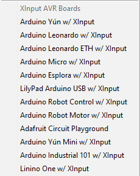
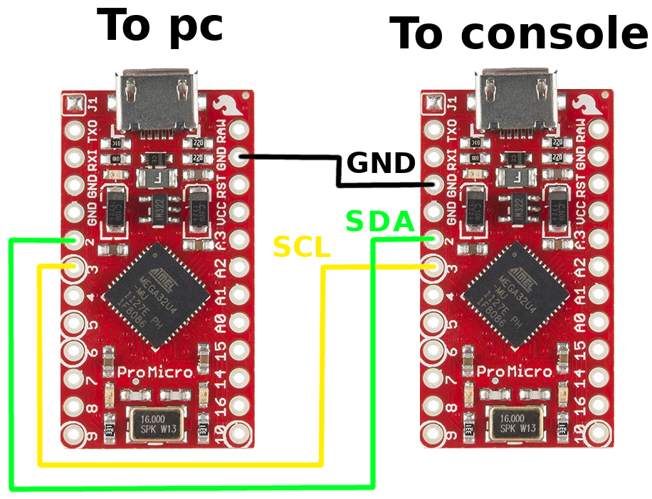
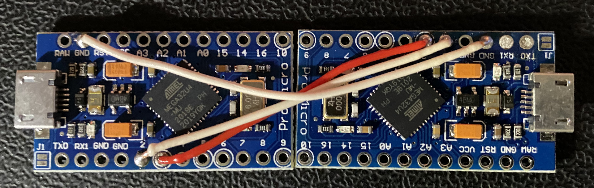

## Introduction

These steps will lead you through the steps of creating this project.
It's not really hard to build since the wiring is minimal and you dont really require much soldering skills.
So dont worry, you can do this!

## Required parts

Before you start you should check if you have all required components.
Below I have listed them for you. 

- 2x Arduino Leonardo or different, [compatible board](https://github.com/dmadison/ArduinoXInput#compatible-boards)
- 2x usb type A to micro-usb cable
- A soldering iron and a few wires
- (Optional, if not supported by default) An adapter that allows you to connect an XInput device to your console (for example the Mayflash "MAGIC-NS" for the Nintendo Switch)
- (Optional) A 3D printer to create a case

## Install the required software and download the source code

First of all, lets start by [downloading the source code](https://github.com/TheRealKasumi/Switch-Controller-Bridge/archive/master.zip).
Extract it to a place where you will find it later again.

To program the two microcontrollers, you will require the [Arduino IDE](https://www.arduino.cc/en/software).
Simply download and install it. 
I know there are other ways as well, but we want to keep it simple.

If the Arduino IDE is installed successfully, you will need to download dmadison's [XInput library](https://github.com/dmadison/ArduinoXInput) and [board definitions](https://github.com/dmadison/ArduinoXInput_AVR).
Unpack the XInput library to `<Arduino install location>\Arduino\libraries\`.
Note that the install location is usually `C:\Program Files (x86)\Arduino\`.
Next unpack the board definitions to `<Arduino install location>\Arduino\hardware\xinput\avr\` so that you have the `bootloaders` folder (and the others) in this directory.

When you now start the Arduino IDE you should see the board definitions under `Tools -> Board`.
The list should look like this.

Also you should be able to see the code examples of this libraries under `File -> Examples -> XInput`.
If that is the case, you are ready to install the software to the microcontrollers.

To get the pc software you have two options.
- Download the windows binary that I provided
- Build it from the source code

In case you decide for the first option, you have nothing more to do than downloading the file.
If you go for the second option, install a C++ compiler of your choice (I use g++) and follow the next steps.

## Compile the pc software

Since the code should be compatible with nearly every C++ compiler under Windows, there is more than one way of doing this.
I personally decided to go with MinGW/g++ for now. 
But feel free to pick the compiler you want.

Before you start to compile the code, make sure that the XInput library is available on your system. 

Then building the code with g++ is as simple as:

`g++ main.cpp serial\SerialPort.cpp controller\XInputController.cpp communication\ArduinoConnection.cpp -lXInput -O3 -o Switch-Controller-Bridge.exe`

This should genderate the executable `Switch-Controller-Bridge.exe` and you are already done with this part.

## Compile the Arduino code and upload it to the boards

At this point its already time to program the microcontrollers.
Go to the location where you saved the downloaded source code.
Navigate to `Arduino\ControllerEmulator\` and open the `ControllerEmulator.ino` file with the Arduino IDE.
Now connect the first microcontroller to your computer.
After the driver was installed (this should happen automatically), you can select your board under `Tools -> Port`.
Also select correct board definition for you board under `Tools -> Board`.
Make sure to select one of the XInput definitions here.
Otherwise it will not work later. 
If everything is set up, go and click the upload button. 
When the upload was successful, it's time to upload to program to the second Arduino.

Please try to remember which board has which Software installed.
The board with the `ControllerEmulator` program will be connected to your console.
The other board will be connected to your computer.

Navigate to `Arduino\SerialToWireConverter\` and open the `SerialToWireConverter.ino` file with the Arduino IDE.
Now connect the second microcontroller to your computer and select your board under `Tools -> Port`.
Also select correct board definition for your board under `Tools -> Board`.
This time pick the normal board definition.
NOT THE XINPUT ONE.
Upload the code again and this part is done. 

## Solder the board together

Don't panic, this part is easier than you may think.
There are only 3 wires to solder to the boards.
The GND wire makes sure that both board have the same ground potential.
This is required, so that both board can communicate properly.
It also protects your board from being damaged in case there is a high potential between the power supply from your computer and your console.
Here all pins with the GND label will work.
So dont worry too much about it.
The SDA wire is used to transfer the data between the two boards.
It connects both pins with the number 2. 
The SCL wire is used to transfer the clock signal. 
It connects both pins with the number 3.   

If you finished that part, you are basically done and ready to test everything.

## Test it

Now it's time to test your build.
If you made everything right, this should wor without any problem.
At first, connect your XInput controller to your computer.
Then connect the right controllers to the pc and the console via your usb cables.
Start your console and open the Arduino IDE again.
Find out which serial port your board (connected to the computer) is currently using and remember the number. 
Now start the pc software and it will ask you for the serial port your controller is listening on.
This the port your read from the Arduino IDE. 
Enter the number and press enter. 
Then the software will ask you to enter the controller number.
So enter this as well and press enter again.
Now the software should connect to your controller board and displays some information's.
This is the state of your controller as well as the sample rate at the bottom.
If you see this screen, congrats. You was successful.
I case this is not working, make sure that you programmed and connected everything correctly.
If it still doesnt work, feel free to ask me for help.